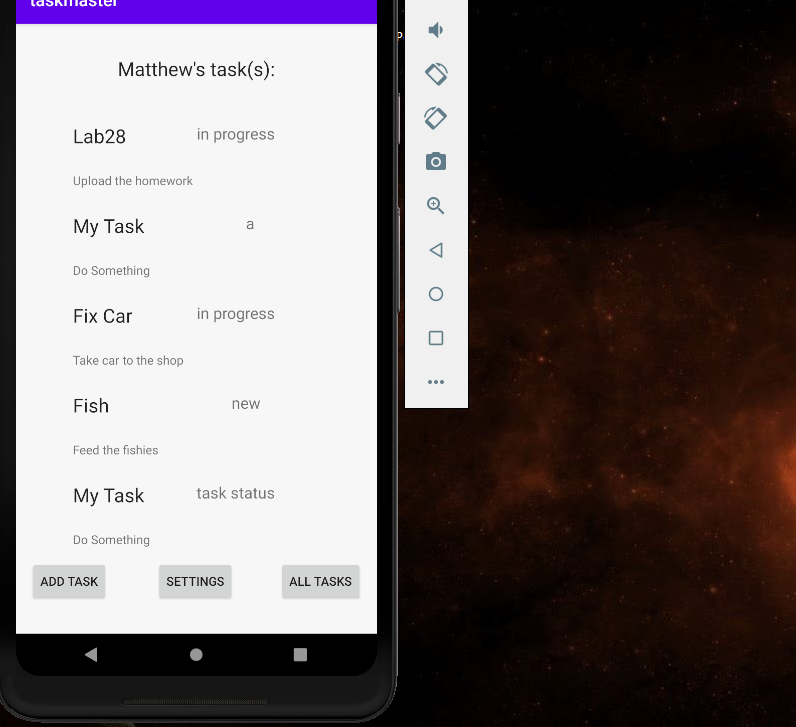

# TaskMaster change log (I will delete it every other day, just to keep track of what I did the previous day)

* 10/26/2020
* Added tests. Tests are currently testing:
* Add task - tests that users can add a task and view it in the recycler.
* Recycler - tests that information is added, visible, and clickable.
* Settings - tests that users can change their username and is displayed in the main activity.


## How to run the app
* Clone the repository from the github
```
 git clone https://github.com/vijayetar/android_taskmaster.git
```

* Open the project using Android Studio

* Run the app using an emulator or on the android phone


## Screen shots of working app
* 
* 
* 
* 
* 