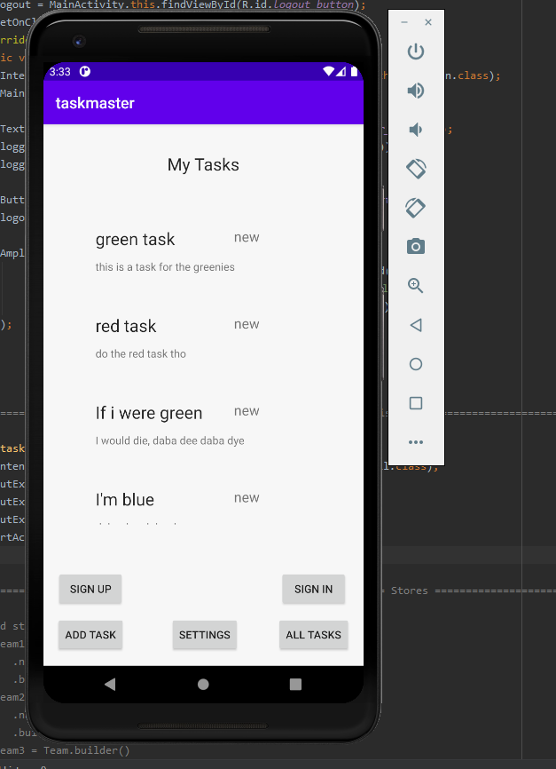
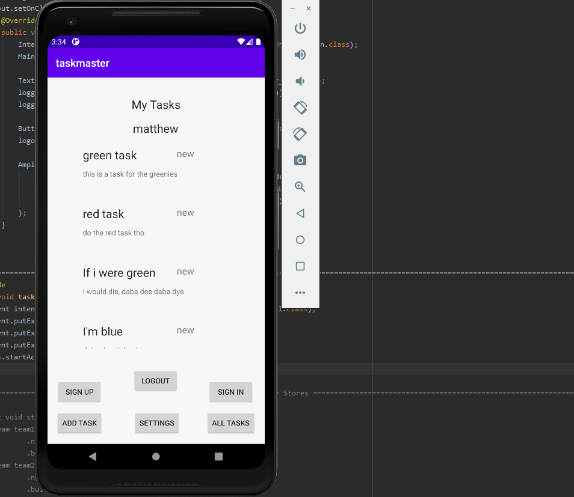
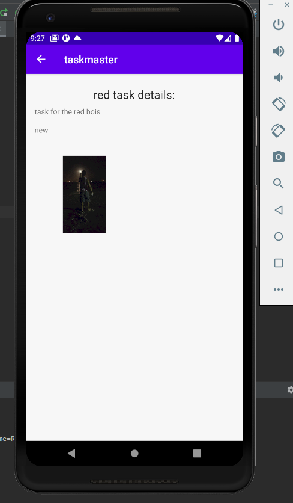
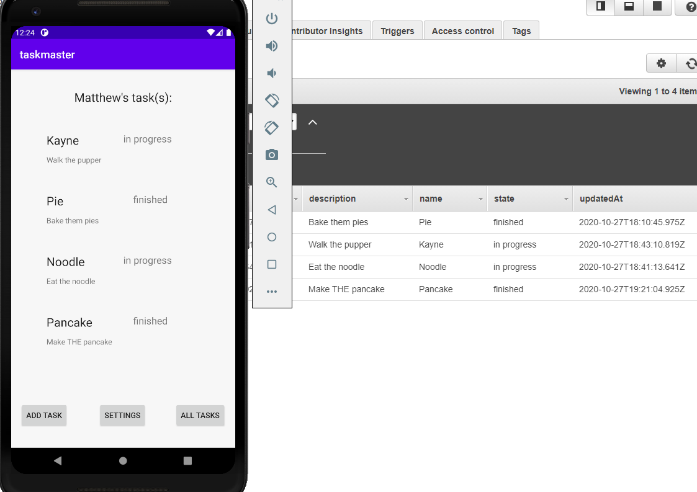
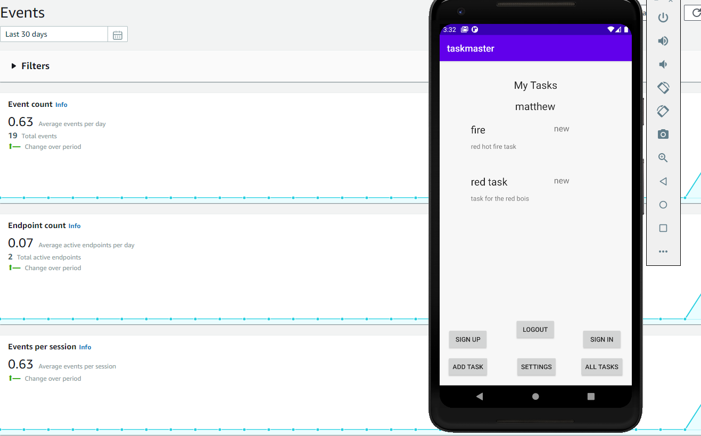

# TaskMaster change log (I will delete it every other day, just to keep track of what I did the previous day)

* 11/4/2020
* Implemented SNS.
* Modified both build.gradle files + manifest
* Created PushListenerService.java.
* Downloaded the google-services.json, placed in app.

* 11/5/2020
* Added analytics to the app
* Currently tracking when users logout/login, when they direct to add-task page and when they load the main page.

## How to run the app
* Clone the repository from the github
```
 git clone https://github.com/mattpet26/android_taskmaster.git
```

* Open the project using Android Studio

* Run the app using an emulator or on the android phone


## Screen shots of working app
* 
* 
* 
* 
* 
* 
* 
* 
* 
* 
* 
* 