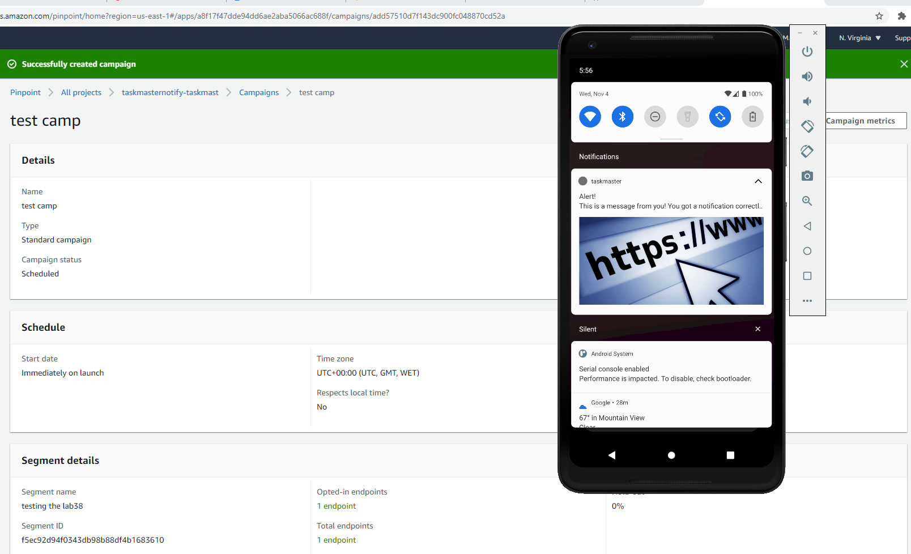
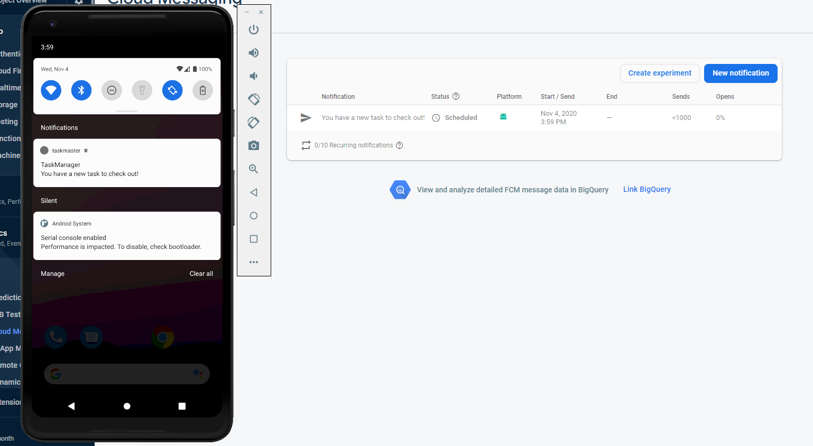
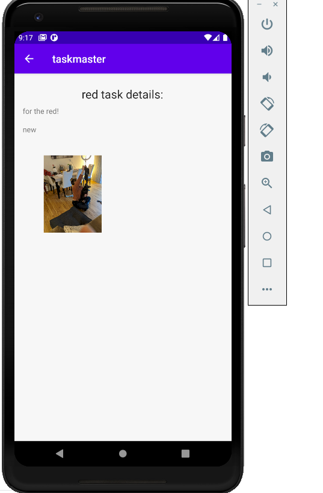
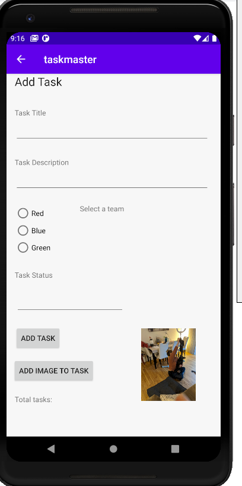
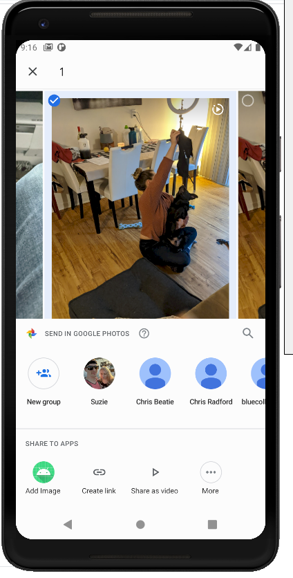
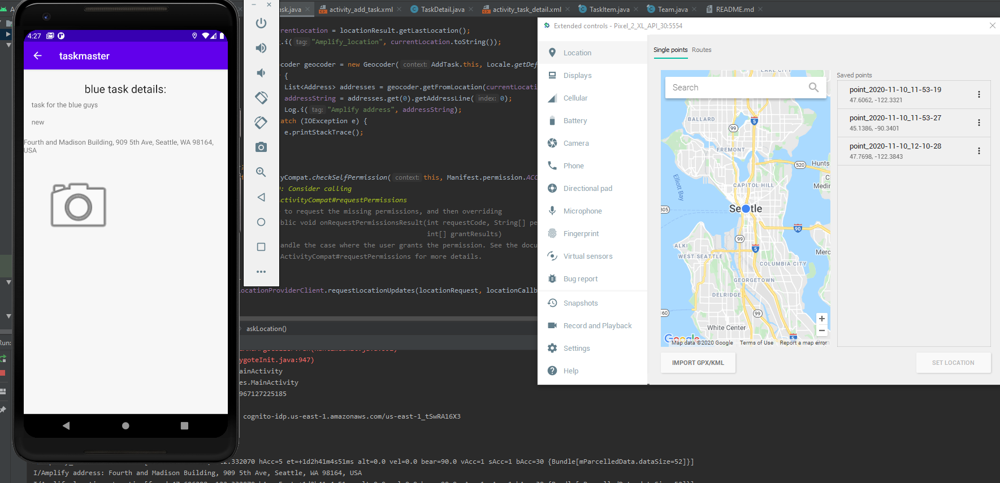

# TaskMaster change log (I will delete it every other day, just to keep track of what I did the previous day)

* 11/11/2020
* Implemented an ad banner on MainActivity

* 11/10/2020
* Users can now enter in a location to the task, the ... button takes the user to the locations available
* The task remembers where each tasks location is

## How to run the app
* Clone the repository from the github
```
 git clone https://github.com/mattpet26/android_taskmaster.git
```

* Open the project using Android Studio

* Run the app using an emulator or on the android phone


## Screen shots of working app
* 
* 

* 
* 
* 
* 