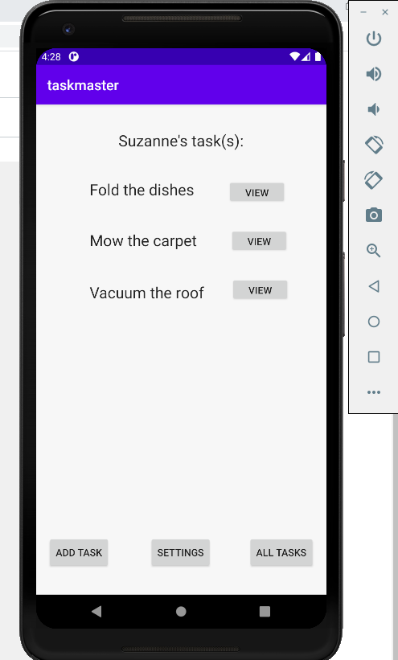

# TaskMaster change log (I will delete it every other day, just to keep track of what I did the previous day)

* 10/21/2020
* Added ViewAdapter, TaskFragment and TaskClass
* Home page now has a recycler view with tasks
* Recyclerview is fully functional, each task is clickable

* 10/22/2020
* Added to the AddTask page. Users tasks are now added to database!
* Users tasks are queried from database, and shown on home screen.
* Created TaskClassDao, utilized Room.


## How to run the app
* Clone the repository from the github
```
 git clone https://github.com/vijayetar/android_taskmaster.git
```

* Open the project using Android Studio

* Run the app using an emulator or on the android phone


## Screen shots of working app
* 
* 
* 
* 
* 